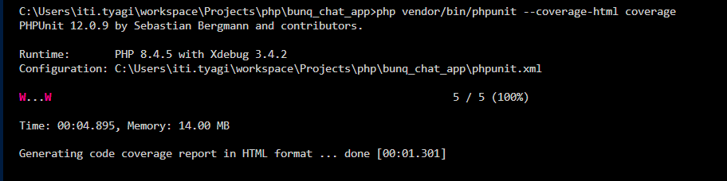

## 
# API Documentation (Making a chat app using PHP Slim Framework)
A chat application backend in PHP. Users should be able to create chat
groups, join these groups and send messages within them. For simplicity, the
groups are public: any user can join any group. Users should be able to list all the
messages within a group

## System Architecture


## Use cases

Register/Login (token is assumed already present here, so can be skipped if not implemented)

Create Chat Group

Join Chat Group

Send Message

View Messages


### Test User (for API testing)

A default user is available in the database:

- **Username:** `testuser`
- **Token:** `testtoken123`

Make sure you are in the root of the directory (where chat.db resides, else you need to adjust the path in the code) and run the following commands:
```sh
sqlite3 chat.db "INSERT INTO users (username, token) VALUES ('testuser', 'testtoken123');"
```

You can use the token in the `Authorization` header for protected routes.

## Start the Server
```sh 
php -S localhost:8080 -t public
```

## Create a Chat Group
```sh
curl -X POST http://localhost:8080/api/groups -H "Content-Type: application/json" -d "{\"name\": \"MyGroup\"}"
```

## List the Group (so that ID is known in curl commands)
```sh
sqlite3 chat.db "SELECT id, name FROM chat_groups;"
```

## Join the Group (I am using id of Group from DB, assuming 1 (you can update it, as per PK from table for the group you created above)

```sh
curl -X POST http://localhost:8080/api/groups/1/join -H "Authorization: testtoken123"
```

## Send Message for the group

```sh
curl -X POST http://localhost:8080/api/groups/1/messages -H "Authorization: testtoken123" -H "Content-Type: application/json" -d "{\"message\": \"Hello from testuser!\"}"
```

## Fetch all the messages from the group

```sh
curl http://localhost:8080/api/groups/1/messages
```

## ==== Logs of all command for reference ====

You can also create group manuall using the sql command, I tried adding via curl command
```sh
curl -X POST http://localhost:8080/api/groups -H "Content-Type: application/json" -d "{\"name\": \"MyGroup\"}"
```
Add user in the database:
```sh
sqlite3 chat.db "INSERT INTO users (username, token) VALUES ('testuser', 'testtoken123');" #the same user is mentioned above

sqlite3 chat.db "SELECT * FROM users;"
```


All the commands and their ouput


In parallel how server was logging


## Testing Statistics
How to run the tests?
From the root folder, please use the below command (there were custom steps needed to run phpunit tests xdebug for coverage, but php documentation was enough to make sure the coverage is also possible, apart from running tests)
```sh
php vendor/bin/phpunit --coverage-html coverage
```


